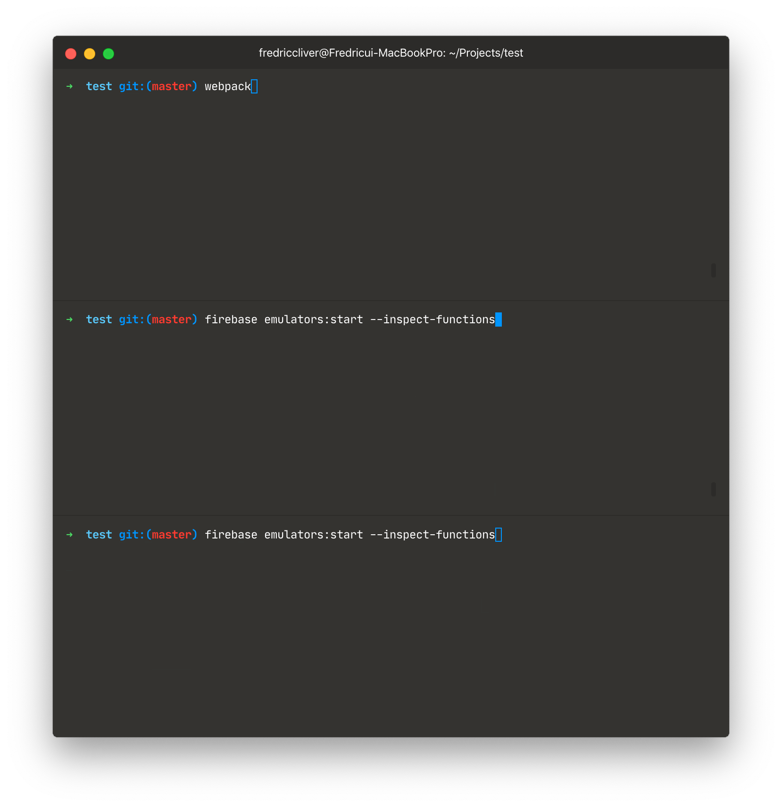
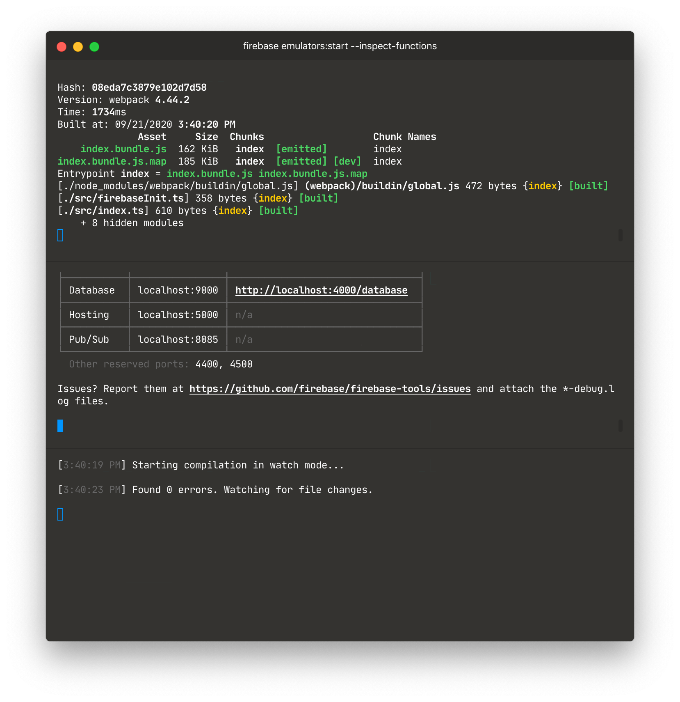
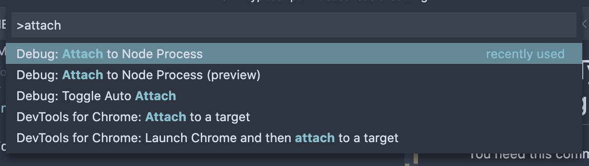
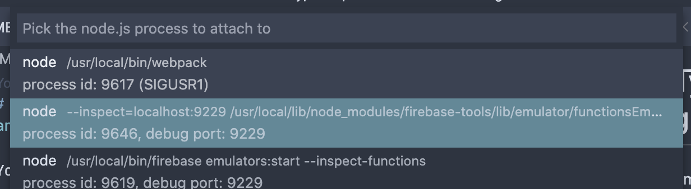
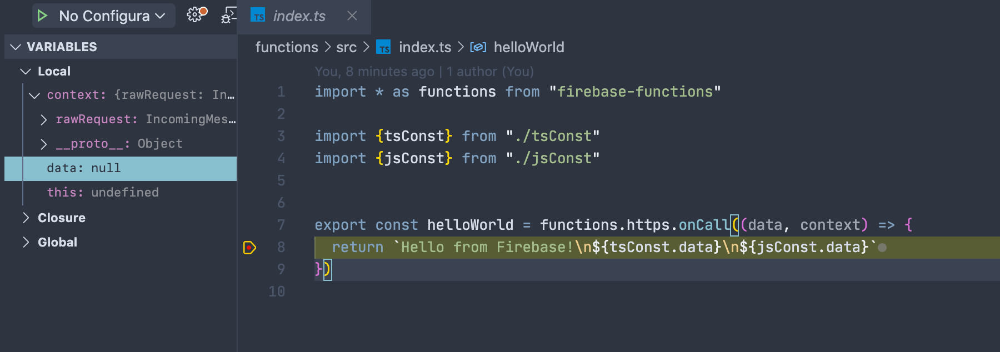

# 🚀 Using Typescript in both side of Hosting and Functions

## Start emulator and typescript transpiler with watch option

```bash
> webpack

> firebase emulators:start --inspect-functions

> tsc -w --project ./functions/tsconfig.json
```




## Connect with VSCode debugger

Attach


9229 is default port for functions remote debugging


You can mark a breakpoint in VSCode



## You have to prepare these files

I ignored these files from github repo.

### firebaseInit.ts

```
export const firebaseConfig = {
  apiKey: --,
  authDomain: --,
  databaseURL: --,
  projectId: --,
  storageBucket: --,
  messagingSenderId: --,
  appId: --
};
```

Only this basic configuration was defined in. 

### .firebaserc

Make this with the firebase init command.
But firebase.json file also would be overrided. So you should override again as same as with this repo's one.