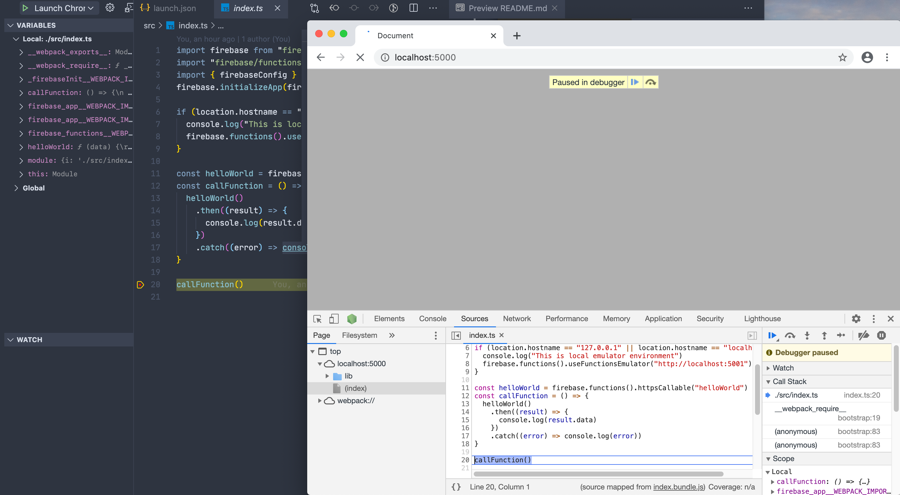

# 🚀 Using Typescript in both side of Hosting and Functions

## Start emulator and typescript transpiler with watch option

```bash
> webpack

> firebase emulators:start --inspect-functions

> tsc -w --project ./functions/tsconfig.json
```


## Connect with VSCode debugger

### Functions-side (for back-end typescript)

Attach


9229 is default port for functions remote debugging


You can mark a breakpoint in VSCode


### Hosting-side (for frond-end typescript)

Define new launch configuration into launch.json


```
{
  "configurations": [

    {
      "name": "Launch Chrome",
      "request": "launch",
      "type": "pwa-chrome",
      "url": "http://localhost:5000",
      "webRoot": "${workspaceFolder}"
    }
  ]
}
```

You're able to mark a breakpoint in VSCode


## You have to prepare these files

I ignored these files from github repo.

### firebaseInit.ts

```
export const firebaseConfig = {
  apiKey: --,
  authDomain: --,
  databaseURL: --,
  projectId: --,
  storageBucket: --,
  messagingSenderId: --,
  appId: --
};
```

Only this basic configuration was defined in.

### .firebaserc

Make this with the firebase init command.
But firebase.json file also would be overrided. So you should override again as same as with this repo's one.

## Video recoding.

Video recoding is here.
[](https://www.youtube.com/watch?v=K5bgHsTLopE)
